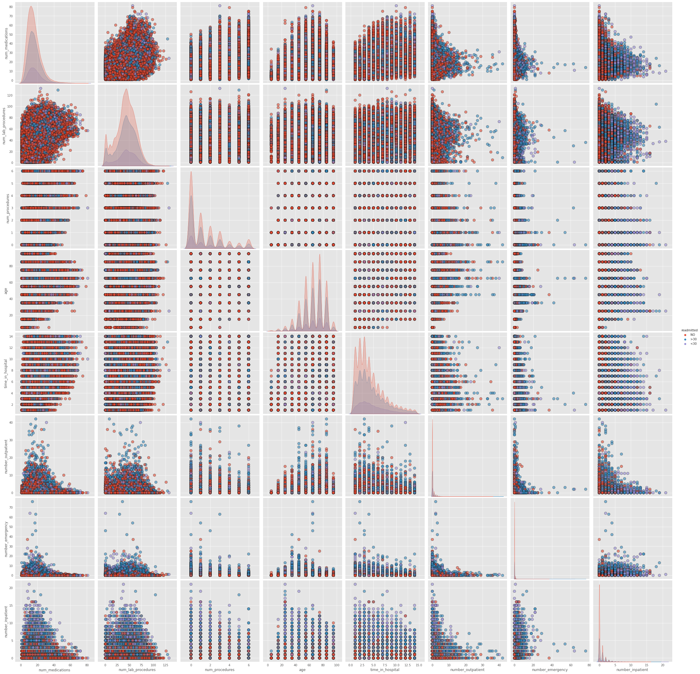
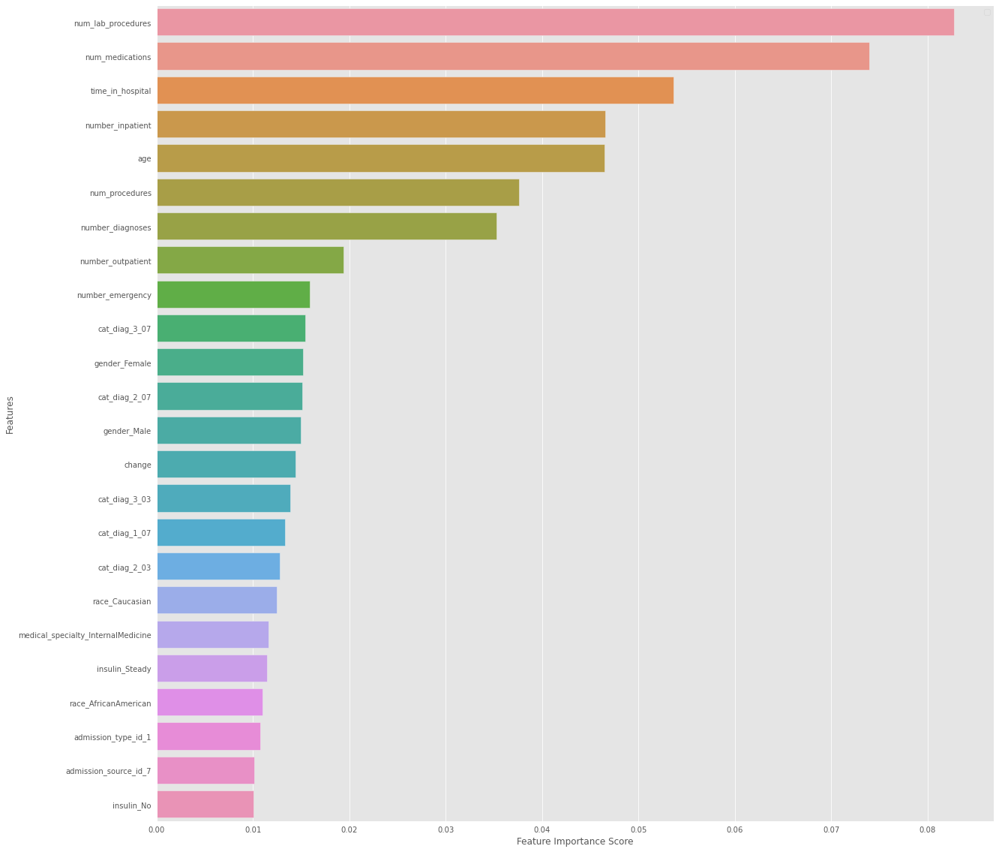

# FIT DS

Vamos a analizar la siguiente gráfica obtenida anteriormente

Acá podemos ver una relación entre las variables `number_inpatient`, `number_outpatient` y los reingresos (`readmitted`) la cual puede ser expresada como:
**Entre más visitas haya tenido en el último año el paciente (tanto ambulatorias como internas), más alta probabilidad de que sea readmitido (un ingreso más)**
Esto tiene sentido dado que daría indicios de un estado de salud agravado en el paciente, el cual requerirá ingresos frecuentes al hospital.

##### Modelos

Ahora, sobre los modelos podemos ver que contemplando variables categoricas presentes en los datos, es costoso generar un modelo que permita predecir eficientemente las tres categorías, sin embargo sí podemos concluir sobre los resultados y las métricas obtenidas que predecir cuándo un paciente va a tener un reingreso en los siguientes 30 días es posible, pero definir si va a reingresar después de 30 días o "nunca" es más complicado y puede que los datos estén bastante mezclados en dicho escenario. Una teoría es que haya factores externos que afectan el reingreso y solo son evidentes en un tramo de más de 30 días, factores como la dieta del paciente o la disciplina con la que toma los medicamentos, lo que puede ser decisivo para que el paciente pueda recuperarse de la condición y evitar así el reingreso al hospital.

En cuanto a los factores que más pueden afectar el reingreso del paciente podemos ver en la siguiente gráfica obtenida anteriormente que los datos que suelen ser más relevantes para definir el reingreso son datos históricos referentes a ingresos al hospital en el último año, así como el tiempo que estuvo en el hospital, la cantidad de medicamentos, procedimientos y tomas laboratorios que se le hicieron al paciente durante la última estadía.

##### Resumen de modelos

Se usaron los siguientes modelos para evaluar los datos:
- All Features
    - Regresion Logística
    - Random Forest
- Solo Insulina
    - Regresion Logística
    - Random Forest
    - XGBoost
- Tres modelos (Binario)
    - Random Forest
    - XGBoost con refinamiento de hyperparámetros
    - XGBoost
- Leave One Out (Binario One Hot)
    - XGBoost
- Kmeans
    - 3 clusters (Primer indicio)
    - 20 clusters
- Apriori
    - Frecuent Items
